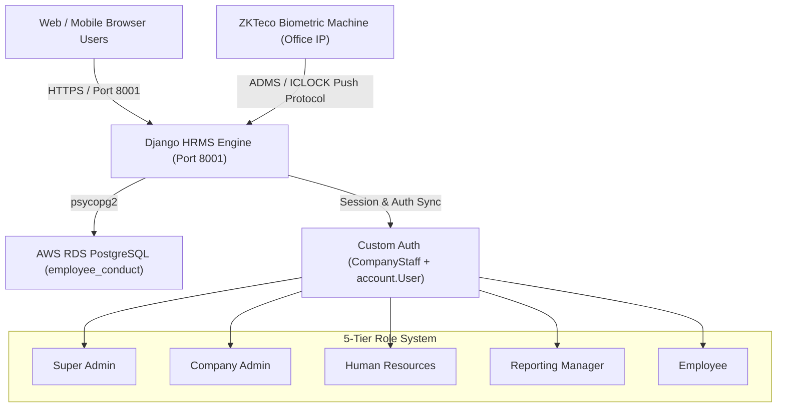
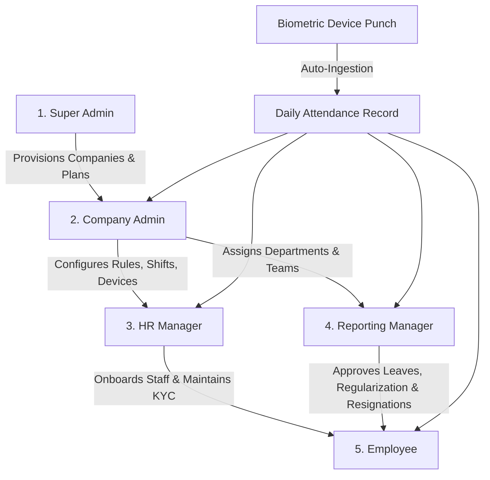

# Eagle in Cloud HRMS & Biometric System

[](https://www.python.org/)
[](https://www.djangoproject.com/)
[](https://aws.amazon.com/rds/postgresql/)
[](http://50.19.21.0:8001)

An enterprise-grade, multi-tenant Human Resource Management System (HRMS) and Biometric Attendance platform developed for **Eagle in Cloud**. It features real-time ZKTeco ADMS hardware integration, 5-level role-based access control, automated attendance reconciliation, leave and regularization workflows, and security policies.

---

## 📑 Table of Contents
1. [Architecture & Tech Stack](#-architecture--tech-stack)
2. [Multi-Role Hierarchy & Step-by-Step Flow](#-multi-role-hierarchy--step-by-step-flow)
3. [Key Modules & Technical Implementations](#-key-modules--technical-implementations)
4. [Hardware Biometric Integration](#-hardware-biometric-integration)
5. [Project Directory Structure](#-project-directory-structure)
6. [Database Schema Reference](#-database-schema-reference)
7. [Local Setup & Installation](#-local-setup--installation)
8. [Production Deployment (AWS EC2)](#-production-deployment-aws-ec2)
9. [Git Branching & Release Pipeline](#-git-branching--release-pipeline)

---

## 🏗 Architecture & Tech Stack



### Core Technologies
- **Backend:** Python 3.9+, Django 5.2.x
- **Authentication:** Custom `AUTH_USER_MODEL = 'account.User'` synchronized with multi-tenant `CompanyStaff`
- **Database:** AWS RDS PostgreSQL (`employee_conduct`)
- **Frontend:** HTML5, CSS3 (Eagle in Cloud Brand System), Bootstrap 5, Boxicons, Bootstrap Icons, Sweetify/SweetAlert2, Flatpickr, Chart.js, jQuery
- **Hardware Integration:** Custom ADMS / ICLOCK HTTP Push Parser (`biometric/` app)
- **Infrastructure:** AWS EC2 (`50.19.21.0`), Port 8001 (`/home/ec2-user/employeeconduct`)

---

## 👥 Multi-Role Hierarchy & Step-by-Step Flow



---

### Level 1: Super Admin (`superadmin`)
- **Route:** `/superadmin/` or `/dashboard/superadmin/`
- **Workflow & Capabilities:**
  1. Multi-tenant company onboarding (`Company` model).
  2. Global group and permission definitions (`Group`, `Permission`, `/role/`, `/rolepermission/<name>`).
  3. System-wide analytics and cross-company tenancy management.

---

### Level 2: Company Admin (`admin`)
- **Route:** `/dashboard/admin/<company_id>/<company_staff_id>/`
- **Workflow & Capabilities:**
  1. **Organization Setup:** Create Departments (`Department`), Designations (`Designation`), Shifts, and Office Timing Rules.
  2. **Staff Administration:** Provision and manage HR accounts, Managers, and Employees.
  3. **Biometric Terminals:** Register and monitor biometric device health (`BiometricDevice`).
  4. **Policy & Compliance:** Full visibility over company-wide attendance logs, leave balances, payroll, and resignations.
  5. **Security Management:** Admin credential management and employee account recovery.

---

### Level 3: Human Resources (`hr`)
- **Route:** `/dashboard/hr/<company_id>/<company_staff_id>/`
- **Workflow & Capabilities:**
  1. **Employee Lifecycle:** Add new employees, manage KYC documents (`Post`), personal details, and emergency contacts.
  2. **Live Biometric Monitoring:** Real-time dashboard showing Present, Absent, Half-Day, Late arrivals, and raw punch logs (`/dashboard/hr/<cid>/<sid>/biometric/`).
  3. **Leave & Shift Administration:** Process leave applications, assign shifts, and configure company holiday calendars.
  4. **Resignation & Offboarding:** Track employee resignations with mandatory exit reasons.
  5. **HR Profile Customization:** Manage HR avatar and personal details (`/dashboard/hr/<cid>/<sid>/profile/`).

---

### Level 4: Reporting Manager (`manager`)
- **Route:** `/managers/dashboard/<company_id>/<company_staff_id>/`
- **Workflow & Capabilities:**
  1. **Subordinate Oversight:** Supervise direct report employees (`employee_reports_to = manager`).
  2. **Approval Engine:** Review, approve, or reject subordinate leave requests, attendance regularization, and shift adjustments.
  3. **Team Performance:** View team attendance calendar, daily punch logs, and departmental goals.
  4. **Self-Service:** Submit manager leaves, attendance regularization, and manager resignations (with mandatory reason validation).

---

### Level 5: Employee (`employee`)
- **Route:** `/employee/employee_dashboard/<company_id>/<company_staff_id>/`
- **Workflow & Capabilities:**
  1. **Personal Attendance:** View daily check-in/check-out punches, total work hours, status, and monthly punch logs.
  2. **Leave Applications:** Apply for Casual, Sick, or Earned leaves with balance deduction.
  3. **Attendance Regularization:** Request punch corrections for missed biometric scans.
  4. **Resignation Submission:** Apply for resignation with mandatory explanation (minimum 5 characters).
  5. **Payroll & Documents:** Download monthly payslips and view company policy documents.

---

## 🔒 Key Modules & Technical Implementations

### 1. 60-Day (2-Month) Password Expiration Policy
- **Model Tracking:** Every `CompanyStaff` record includes `password_changed_at` datetime.
- **Login Verification:** On login ([`account/views.py`](file:///c:/Users/Dell/Desktop/Ronak%20Ec/Employee-Conduct--main/account/views.py) `Login.post`), `staff.is_password_expired(expiry_days=60)` verifies if the password is older than 60 days.
- **Lockout Mechanism:** If expired, `request.session['password_expired'] = True` is set and the user is redirected to `/expired_password/`.
- **Middleware Guard:** [`account/middleware.py`](file:///c:/Users/Dell/Desktop/Ronak%20Ec/Employee-Conduct--main/account/middleware.py) (`SessionSecurityMiddleware`) blocks navigation to protected areas (`/administration/`, `/managers/`, `/employee/`, `/dashboard/`) until renewed.
- **Universal Synchronization:** Any password change (Admin, Manager, Employee, or Forgot Password link) automatically resets `password_changed_at` to `timezone.now()`.

### 2. Dual Model Authentication & Password Sync
- `CompanyStaff` manages multi-tenant staff, credentials, and roles.
- `account.User` is Django's `AUTH_USER_MODEL`.
- All password update endpoints hash and synchronize both models simultaneously using `make_password()`.

### 3. Mandatory Resignation Reason
- Frontend validation (`required minlength="5"`) and backend verification in both Employee and Manager views enforce non-empty, descriptive reasons for all resignation requests.

---

## 📟 Hardware Biometric Integration

The platform includes a push protocol listener that communicates with ZKTeco ADMS/ICLOCK biometric devices:

1. **Root Router (`biometric/views.py`):**
   - Intercepts hardware requests (`/iclock/cdata?SN=...`) while allowing standard browser logins (`/`) seamlessly.
2. **Device Handshake:**
   - Device calls `GET /iclock/cdata?SN=<SERIAL_NUMBER>&options=all`.
   - Server returns registry parameters (`RegistryCode=1`, `ServerVersion=3.0.1`, etc.).
3. **Attendance Push (`ATTLOG`):**
   - Device sends raw punches via `POST /iclock/cdata?table=ATTLOG`.
   - Parser decodes `PIN` (biometric ID), `CHECKTIME` (timestamp), and `STATUS`.
   - Matches `PIN` to `Employee.biometric_id`.
   - Creates a `BiometricEventLog` record and creates/updates the daily `Attendance` record (calculating check-in, check-out, duration, and status).
   - Responds with `OK: <count>`.

---

## 📁 Project Directory Structure

```
Employee-Conduct--main/
├── account/               # Custom User, CompanyStaff, HR Profile, Password Expiry Policy
├── administration/        # Company Admin Portal, Organization Settings, Staff Management
├── biometric/             # ZKTeco ADMS Push API, Punch Parser, Biometric Device Registry
├── employee/              # Employee Self-Service Portal, Attendance, Leave, Resignation
├── managers/              # Manager Portal, Team Approvals, Subordinate Management
├── leave/                 # Employee Leave Models & Workflows
├── manager_leave/         # Manager Leave Models & Workflows
├── resign/                # Employee Resignation Models & Workflows (Mandatory Reason)
├── manager_resign/        # Manager Resignation Models & Workflows (Mandatory Reason)
├── regularization/        # Employee Attendance Regularization
├── manageregularization/  # Manager Attendance Regularization
├── payroll/               # Employee Payroll & Salary Slips
├── managerpayroll/        # Manager Payroll
├── dstt/                  # Project Configuration (settings.py, urls.py, wsgi.py)
└── templates/ & static/   # Global UI Templates and Static Assets
```

---

## 🗄 Database Schema Reference

| Model | App | Description |
| :--- | :--- | :--- |
| `Company` | `account` | Multi-tenant organization profile (name, email, phone, address). |
| `CompanyStaff` | `account` | Central staff credentials, role (`admin`, `hr`, `manager`, `employee`), password hash, `password_changed_at`. |
| `User` | `account` | Custom Django user model (`AUTH_USER_MODEL`). |
| `Employee` | `employee` | Comprehensive employee profile, biometric ID, department, manager, salary, status. |
| `Attendance` | `employee` | Daily attendance records (date, check-in, check-out, work hours, status). |
| `BiometricDevice` | `biometric` | Registered biometric hardware terminals (serial number, IP, status, last activity). |
| `BiometricEventLog` | `biometric` | Raw punch event logs captured directly from hardware machines. |
| `Manager` | `managers` | Department manager profile linked to `CompanyStaff`. |
| `Leave` / `MLeave` | `leave` / `manager_leave` | Leave applications and balance tracking. |
| `Resignation` / `ManagerResignation` | `resign` / `manager_resign` | Resignation requests with mandatory exit reasons. |
| `Regularization` | `regularization` | Attendance punch correction requests. |

---

## 💻 Local Setup & Installation

### Prerequisites
- Python 3.9+
- PostgreSQL database
- Git

### Steps
1. **Clone the repository:**
   ```bash
   git clone https://github.com/eagleincloud/employee_conduct_v2.git
   cd employee_conduct_v2/Employee-Conduct--main
   ```
2. **Create and activate virtual environment:**
   ```bash
   # Linux / macOS:
   python3 -m venv venv
   source venv/bin/activate

   # Windows PowerShell:
   python -m venv venv
   .\venv\Scripts\Activate.ps1
   ```
3. **Install dependencies:**
   ```bash
   pip install -r requirements.txt
   ```
4. **Configure environment variables (`.env`):**
   ```ini
   SECRET_KEY=your-django-secret-key
   DEBUG=True
   DB_NAME=employee_conduct
   DB_USER=your_postgres_user
   DB_PASSWORD=your_postgres_password
   DB_HOST=your_db_host
   DB_PORT=5432
   ```
5. **Run database migrations:**
   ```bash
   python manage.py migrate
   ```
6. **Start local development server:**
   ```bash
   python manage.py runserver 0.0.0.0:8001
   ```

---

## 🚀 Production Deployment (AWS EC2)

The application runs as a production service on AWS EC2 (`50.19.21.0`) on port `8001`.

```bash
# 1. SSH into the server
ssh -i "new-eic-website.pem" ec2-user@50.19.21.0

# 2. Navigate to project directory
cd /home/ec2-user/employeeconduct

# 3. Activate virtual environment & run migrations
source venv/bin/activate
python manage.py migrate

# 4. Restart Django service on port 8001
sudo fuser -k 8001/tcp || true
nohup python -u manage.py runserver 0.0.0.0:8001 > django.log 2>&1 &
sleep 3

# 5. Verify service is listening
sudo lsof -i :8001

# 6. Stream live logs
tail -f django.log
```

---

## 🌿 Git Branching & Release Pipeline

- **`employee_conduct_v2`:** Active feature development branch.
- **`main`:** Production deployment branch connected to GitHub Actions (`.github/workflows/deploy.yml`).
- **Deployment Secret:** `EMP_CON` (contains SSH key for automated EC2 deployment).

```bash
# Typical release workflow:
git checkout employee_conduct_v2
git add .
git commit -m "Your feature description"
git push origin employee_conduct_v2

# Merge to main for production release:
git checkout main
git merge employee_conduct_v2
git push origin main
git checkout employee_conduct_v2
```

---

© Eagle in Cloud. All rights reserved.