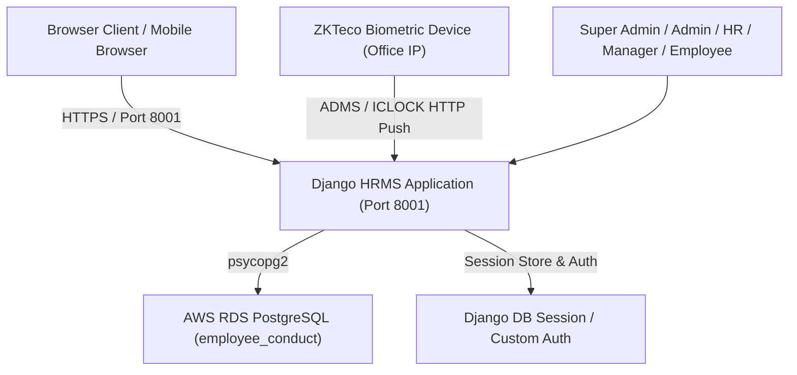
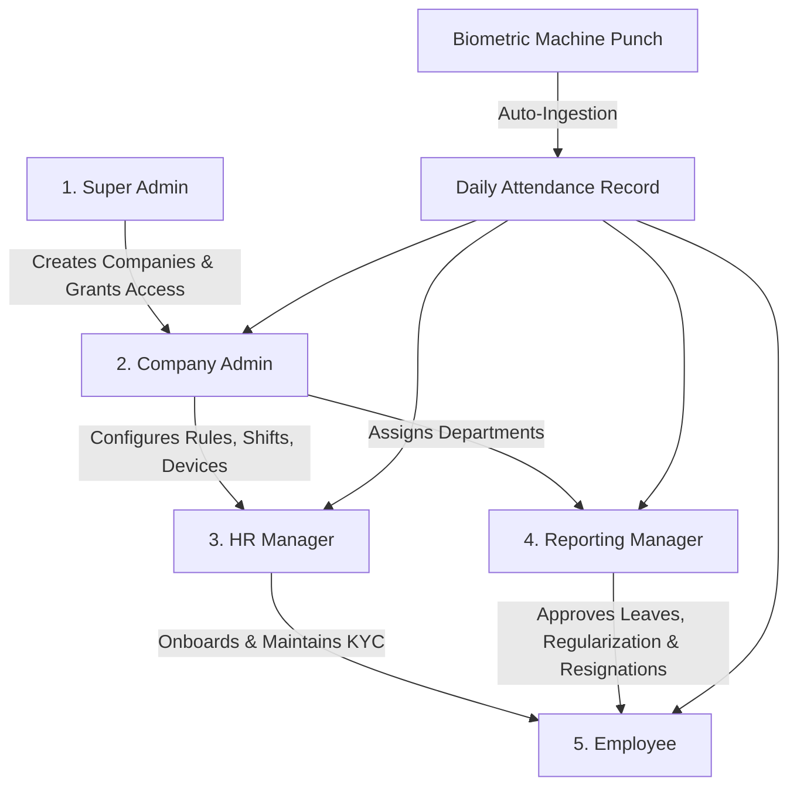

# Eagle in Cloud HRMS — Developer Handover & Architecture Guide

## 1. Executive Summary & Project Overview

**Eagle in Cloud HRMS** is a multi-tenant Human Resource Management System (HRMS) and Biometric Attendance platform built using Python/Django and PostgreSQL. It integrates real-time hardware biometric attendance capture (ZKTeco ADMS/ICLOCK push protocol) with role-based enterprise HR workflows (Superadmin, Company Admin, HR, Manager, and Employee).

---

## 2. Technology Stack & Infrastructure



### Core Technologies
- **Backend Framework:** Python 3.9+ / Django 5.2.x
- **Custom Authentication Model:** `AUTH_USER_MODEL = 'account.User'` with multi-tenant `CompanyStaff` mapping
- **Database:** AWS RDS PostgreSQL (`employee_conduct`)
- **Frontend / UI:** HTML5, Vanilla CSS3 (Eagle in Cloud Design Tokens), Bootstrap 5, Bootstrap Icons, Boxicons, Sweetify / SweetAlert2, Flatpickr, Chart.js, jQuery
- **Hardware Integration:** ZKTeco ADMS / ICLOCK Push Protocol Parser (`biometric/` app)

### Infrastructure & Hosting
- **Server:** AWS EC2 Instance (`50.19.21.0`, Amazon Linux, user: `ec2-user`)
- **Live Production URL (SSL):** `https://eagleinclouds.com/hrms/`
- **Port Mapping:**
  - `Port 8001`: Django HRMS Application (`/home/ec2-user/employeeconduct` -> `https://eagleinclouds.com/hrms/`)
  - `Port 3000`: Next.js Main Website (`https://eagleinclouds.com/`)
  - `Ports 80 / 443`: Nginx reverse proxy with automated SSL (Let's Encrypt Certbot)
- **Version Control & CI/CD:**
  - Active branches: `main` (production deployment via GitHub Actions `.github/workflows/deploy.yml`) and `employee_conduct_v2` (active development branch).
  - SSH Deployment Secret: `EMP_CON`

---

## 3. System Architecture & Directory Structure

```
Employee-Conduct--main/
├── account/               # Authentication, Custom User, CompanyStaff, HR Profile, 60-Day Expiration
├── administration/        # Company Admin Dashboard, Department, Designation, Policy settings
├── biometric/             # ZKTeco ICLOCK ADMS Push API, punch parser, device registry
├── employee/              # Employee Portal, personal attendance, leaves, resignation, profile
├── managers/              # Manager Portal, subordinate approvals, team attendance, manager leaves
├── leave/                 # Employee leave models & workflows
├── manager_leave/         # Manager leave models & workflows
├── resign/                # Employee resignation models & workflow (mandatory reasons)
├── manager_resign/        # Manager resignation models & workflow (mandatory reasons)
├── regularization/        # Employee attendance regularization
├── manageregularization/  # Manager attendance regularization
├── payroll/               # Employee payroll & salary slips
├── managerpayroll/        # Manager payroll
├── dstt/                  # Django project root settings (`settings.py`, `urls.py`, `wsgi.py`)
└── static/ & templates/   # Global static assets and UI templates
```

---

## 4. Multi-Tenant Role Hierarchy & Step-by-Step Flow



---

### Level 1: Super Admin (`superadmin`)
- **Target URL:** `/superadmin/` or `/dashboard/superadmin/`
- **Key Responsibilities:**
  1. Multi-tenant company onboarding (`Company` model).
  2. Global role and permission provisioning (`Group`, `Permission`, `/role/`, `/rolepermission/<name>`).
  3. Master system health and tenancy oversight.

---

### Level 2: Company Admin (`admin`)
- **Target URL:** `/dashboard/admin/<company_id>/<company_staff_id>/`
- **Key Responsibilities:**
  1. **Organization Setup:** Create Departments (`Department`), Designations (`Designation`), Shifts, and Office Timing Rules.
  2. **Staff Provisioning:** Add and manage HR accounts, Managers, and Employees.
  3. **Biometric Infrastructure:** Register and monitor biometric device health (`BiometricDevice`).
  4. **Policy & Compliance:** Oversee company-wide attendance logs, leave balances, salary structures, and resignations.
  5. **Security Settings:** Change admin password, reset employee credentials.

---

### Level 3: Human Resources (`hr`)
- **Target URL:** `/dashboard/hr/<company_id>/<company_staff_id>/`
- **Key Responsibilities:**
  1. **Employee Lifecycle Management:** Add new employees, update KYC documents (`Post`), personal details, and emergency contacts.
  2. **Live Attendance Monitoring:** Real-time dashboard showing Present, Absent, Half-Day, Late arrivals, and raw punch logs (`/dashboard/hr/<cid>/<sid>/biometric/`).
  3. **Shift & Leave Management:** Process leave applications, assign shifts, and manage company holidays.
  4. **Resignation & Offboarding:** Track resignations with mandatory exit explanations.
  5. **HR Profile Customization:** Manage HR avatar and bio (`/dashboard/hr/<cid>/<sid>/profile/`).

---

### Level 4: Reporting Manager (`manager`)
- **Target URL:** `/managers/dashboard/<company_id>/<company_staff_id>/`
- **Key Responsibilities:**
  1. **Subordinate Oversight:** Supervise employees reporting to this manager (`employee_reports_to`).
  2. **Approval Hierarchy:** Review, approve, or reject team leave requests, attendance regularization, and shift adjustment requests.
  3. **Team Performance & Attendance:** View team calendar, punch timings, and goal tracking.
  4. **Self-Service:** Submit manager leave requests, regularization, and manager resignations (with mandatory reason validation).

---

### Level 5: Employee (`employee`)
- **Target URL:** `/employee/employee_dashboard/<company_id>/<company_staff_id>/`
- **Key Responsibilities:**
  1. **Personal Attendance Tracking:** View daily check-in/check-out punches, total work hours, status, and monthly punch logs.
  2. **Leave Management:** Apply for Casual, Sick, or Earned leaves with balance tracking.
  3. **Attendance Regularization:** Request punch corrections for missed biometric scans.
  4. **Resignation Submission:** Apply for resignation with mandatory reason (minimum 5 characters).
  5. **Payroll & Documents:** Download monthly payslips and view company policy documents.

---

## 5. Core Architectural Modules & Implementations

### A. 60-Day (2-Month) Password Expiration Policy
- **Tracking:** Every `CompanyStaff` has a `password_changed_at` datetime field.
- **Evaluation:** On login (`account/views.py` `Login.post`), `staff.is_password_expired(expiry_days=60)` checks if the password is older than 60 days.
- **Enforcement:** If expired, `request.session['password_expired'] = True` is set, and the user is redirected to `/expired_password/`.
- **Middleware Lockout:** `account/middleware.py` (`SessionSecurityMiddleware`) blocks navigation to `/administration/`, `/managers/`, `/employee/`, and `/dashboard/` until the password is renewed.
- **Synchronization:** Whenever a password is changed anywhere in the system (Admin settings, Manager settings, Employee settings, Forgot password link), `password_changed_at` is reset to `timezone.now()`.

### B. Biometric Device Push Protocol Engine (`biometric/`)
- **Protocol:** ZKTeco ADMS HTTP push protocol over port 8001.
- **Root Router:** `biometric/views.py` (`root_router_view`) intercepts device queries (`/iclock/cdata?SN=...`) while allowing browser users at `/` to view the web login screen.
- **Attendance Processing:**
  1. Device sends attendance table via `POST /iclock/cdata?table=ATTLOG`.
  2. The parser extracts `PIN` (biometric ID), `CHECKTIME` (timestamp), `STATUS` (punch type), and `VERIFY`.
  3. Matches the `PIN` with `Employee.biometric_id`.
  4. Creates a `BiometricEventLog` record and updates/creates the daily `Attendance` record (calculating check-in, check-out, duration, and status).
  5. Responds with `OK: <count>` to acknowledge the device.

### C. Mandatory Resignation Reason Rule
- Both Employee and Manager resignation submission views validate that the reason is mandatory (`minlength="5"` on frontend + backend validation).
- Prevents submission of empty or truncated resignation requests.

---

## 6. Developer Setup & Deployment Guide

### Local Development Setup
1. **Clone the repository:**
   ```bash
   git clone https://github.com/eagleincloud/employee_conduct_v2.git
   cd employee_conduct_v2/Employee-Conduct--main
   ```
2. **Create and activate virtual environment:**
   ```bash
   # Windows PowerShell:
   python -m venv venv
   .\venv\Scripts\Activate.ps1

   # Linux / macOS:
   python3 -m venv venv
   source venv/bin/activate
   ```
3. **Install dependencies:**
   ```bash
   pip install -r requirements.txt
   ```
4. **Configure environment variables (`.env`):**
   ```ini
   SECRET_KEY=your-django-secret-key
   DEBUG=True
   DB_NAME=employee_conduct
   DB_USER=your_db_user
   DB_PASSWORD=your_db_password
   DB_HOST=your-rds-endpoint.rds.amazonaws.com
   DB_PORT=5432
   ```
5. **Run migrations and start local dev server:**
   ```bash
   python manage.py migrate
   python manage.py runserver 0.0.0.0:8001
   ```

---

### Production Deployment to AWS EC2

1. **Connect via SSH:**
   ```bash
   ssh -i "path/to/new-eic-website.pem" ec2-user@50.19.21.0
   ```
2. **Deploy updates and reload Django service (Port 8001):**
   ```bash
   cd /home/ec2-user/employeeconduct
   source venv/bin/activate
   python manage.py migrate
   sudo fuser -k 8001/tcp || true
   nohup python -u manage.py runserver 0.0.0.0:8001 > django.log 2>&1 &
   sleep 3
   sudo lsof -i :8001
   ```
3. **Monitor Django and Biometric logs:**
   ```bash
   tail -f /home/ec2-user/employeeconduct/django.log
   ```

---

## 7. Key Database Models Reference

| Model | App | Description |
| :--- | :--- | :--- |
| `Company` | `account` | Multi-tenant organization profile (name, email, phone, address). |
| `CompanyStaff` | `account` | Central staff credentials, role mapping (`admin`, `hr`, `manager`, `employee`), password hash, `password_changed_at`. |
| `User` | `account` | Django custom auth user model (`AUTH_USER_MODEL`). |
| `Employee` | `employee` | Comprehensive employee profile, biometric ID, department, manager, salary, KYC documents. |
| `Attendance` | `employee` | Daily attendance records (date, check-in, check-out, working hours, attendance status). |
| `BiometricDevice` | `biometric` | Registered biometric hardware terminals (serial number, IP, status, last activity). |
| `BiometricEventLog` | `biometric` | Raw punch logs received directly from biometric push machines. |
| `Manager` | `managers` | Department manager profile linked to `CompanyStaff`. |
| `Leave` / `MLeave` | `leave` / `manager_leave` | Leave applications for employees and managers. |
| `Resignation` / `ManagerResignation` | `resign` / `manager_resign` | Resignation requests with mandatory exit reasons. |
| `Regularization` | `regularization` | Attendance punch correction requests. |
